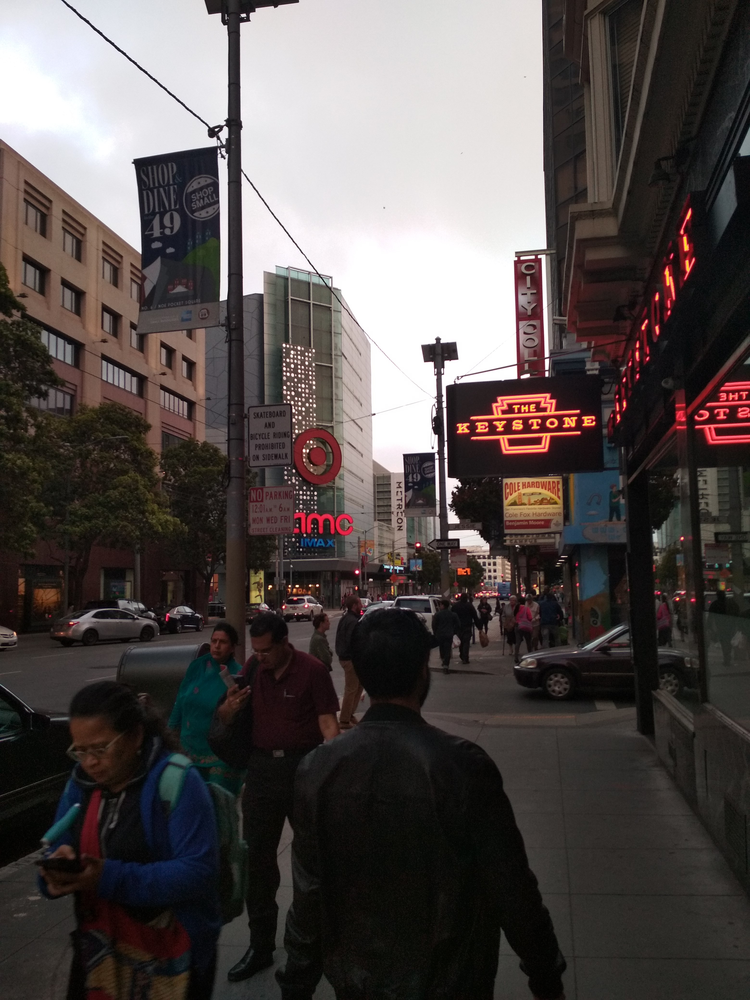
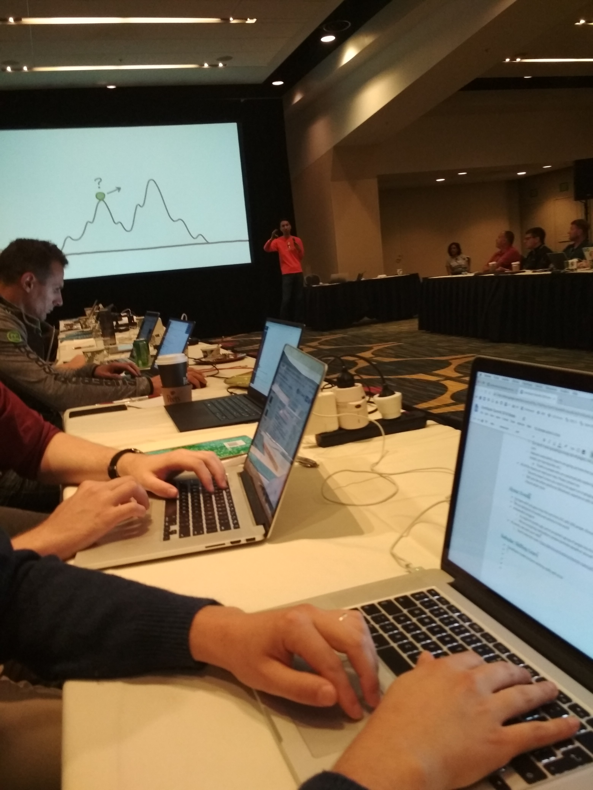
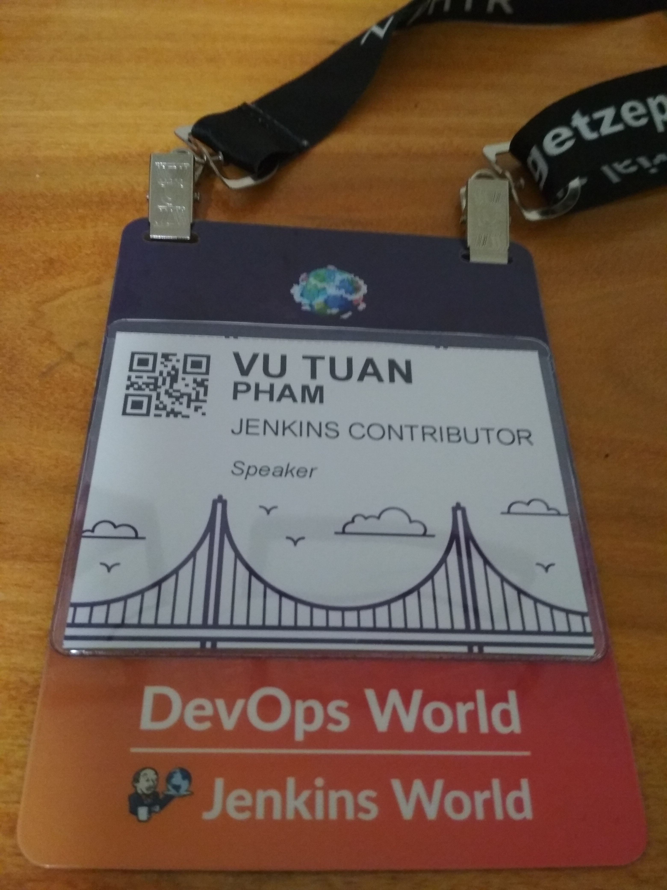

One month ago, I was invited to attend [DevOps World - Jenkins World 2018](https://www.cloudbees.com/devops-world/san-francisco) conference in San Francisco. For a young fresh graduate like me, it was a very great experience.

I was going to SF is to present what I did 2 months ago during [Google Summer of Code 2018](https://summerofcode.withgoogle.com/) for [Jenkins](https://github.com/jenkinsci/jenkins). My project is [Remoting Kafka Plugin](https://github.com/jenkinsci/remoting-kafka-plugin) and I did my presentation about my projet during Jenkins Contributor Summit at the event. I am going to have a summary about my trip in this post and if you are still reading, it will be a long post ahead ^^

# Day 1: Travel day

I flew from Singapore to San Francisco on Saturday with Cathay Pacific and transit in Hong Kong. The flight was delayed 1.5 hours in Singapore and I was quite rushed with the transit, not very sure why I don't book the direct flight in the first place T_T. However, I still safely arrived to SF and this is what SF looked like when I arrived there.

During evening, I had a chance to meet and had dinner with [Oleg](https://github.com/oleg-nenashev), my mentor during GSoC. Oleg helped me a lot with the project during summer and finally we had a chance to meet in person, not by Google Hangout call. This is the picture that we took together during the day of conference.

# Day 2: Free day

I got a Sunday free before the conference and I spent most of the time to recover and go shopping to buy some gifts for my family and friends. Because I visited SF last year already, there is no tourist place that interests me this time. I also had a chance to meet [Martin](https://github.com/martinda) in person. He is also another GSoC mentor, but I did not work directly with him. This was a good day to rest before the next 5 days of conference and hackathon.

# Day 3: Jenkins Contributor Summit

Monday is the day of Jenkins Contributor Summit where people from all over the world come to the Summit to summarize about Jenkins community in the previous year. The morning session focused to summarize Jenkins main areas. If you are interested to know more, can find it in the [Google docs](https://docs.google.com/document/d/1by_lYIwPhburTqmtTvEqek6ifc2qnqBJKyDVslGa4Kc/edit?usp=sharing).

<figure>
  
  <figcaption>
<a href="https://en.wikipedia.org/wiki/Kohsuke_Kawaguchi/">Kohsuke</a> speak at the summit about Jenkins <a href="https://jenkins.io/blog/2018/08/31/shifting-gears/">Shifting Gears</a>
</figcaption>
</figure>

In the afternoon, people are separated in to different SIG meeting of Jenkins called BoF table. I decided to join Cloud Native BoF where I had my presentation about [Remoting Kafka Plugin](https://docs.google.com/presentation/d/1drRIDNvDKdBE-VuuLFXlWRB0NhSFr1aWrg2p8qrF3co/edit?usp=sharing) - GSoC project that I did last summer. Summary of SIG meeting available [here](https://docs.google.com/document/d/1Hw1mpXSpH8BAe2YK5SrCfFuHQLRf__KnjDBK_SbhGls/edit?usp=sharing).

In the evening I was invited to attend Jenkins Contributor Appreciation Event where we come to a restaurant nearby to have food, drinks and talk with contributors of Jenkins project. Interestingly, the restaurant is also decorated with ping pong tables.

I also had a chance to take picture with [Kohsuke](https://en.wikipedia.org/wiki/Kohsuke_Kawaguchi) - the creator of Jenkins software.

# Day 4: Conference Day 1

Tuesday is the first day of DevOps World - Jenkins World 2018. This is the first time ever in my life that I have a chance to atend a tech conference. This conference is big with around 2000 participants from tech companies all over the world.

<figure>
  
  <figcaption>
Conference Main Lobby
</figcaption>
</figure>

<figure>
  
  <figcaption>
My name tag 😛
</figcaption>
</figure>

Morning session is where the keynotes are delivered by CEO, CTO and CPO of [CloudBees](https://www.cloudbees.com/) about DevOps and Jenkins.