One month ago, I was invited to attend [DevOps World - Jenkins World 2018](https://www.cloudbees.com/devops-world/san-francisco) conference in San Francisco. For a young fresh graduate like me, it was a very great experience.

I was going to SF is to present what I did 2 months ago during [Google Summer of Code 2018](https://summerofcode.withgoogle.com/) for [Jenkins](https://github.com/jenkinsci/jenkins). My project is [Remoting Kafka Plugin](https://github.com/jenkinsci/remoting-kafka-plugin) and I did my presentation about my projet during Jenkins Contributor Summit at the event. I am going to have a summary about my trip in this blogpost.

**TL;DR**: This is going to be a long blogpost ahead and you may find English grammar errors in my writing. Hope you can understand because I am not a native English speaker :) 

# Day 1: Travel day

I flew from Singapore to San Francisco on Saturday with Cathay Pacific and transit in Hong Kong. The flight was delayed 1.5 hours in Singapore and I was quite rushed with the transit, not very sure why I don't book the direct flight in the first place T_T. However, I still safely arrived to SF and this is what SF looked like when I arrived there.

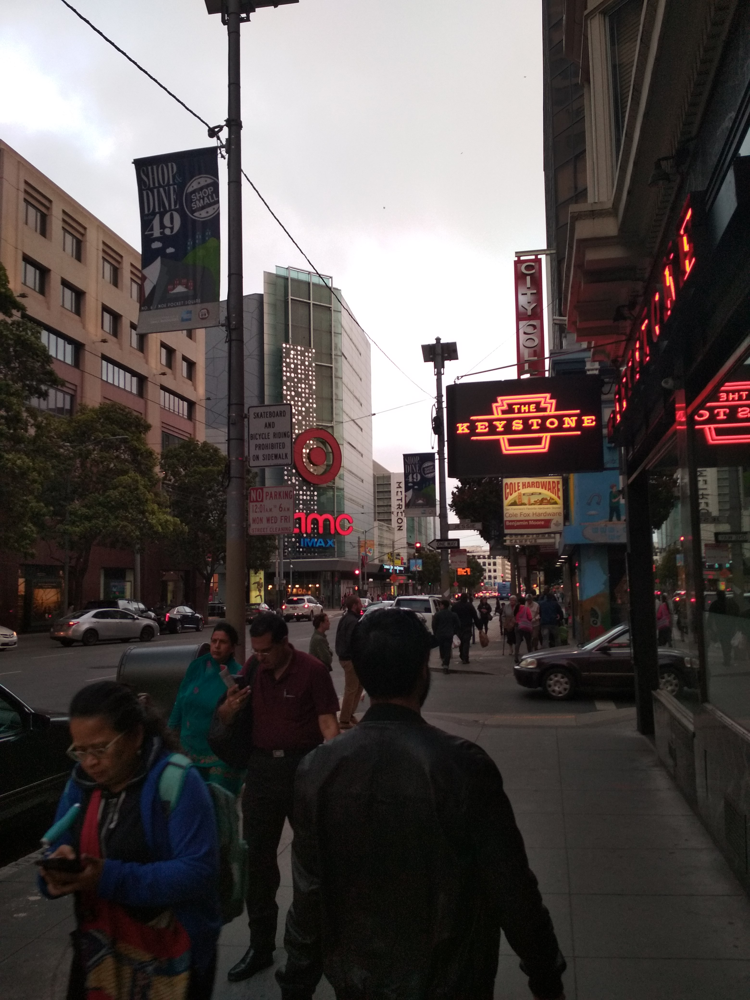

During evening, I had a chance to meet and had dinner with [Oleg](https://github.com/oleg-nenashev), my mentor during GSoC. Oleg helped me a lot with the project during summer and finally we had a chance to meet in person, not by Google Hangout call. This is the picture that we took together during the day of conference.

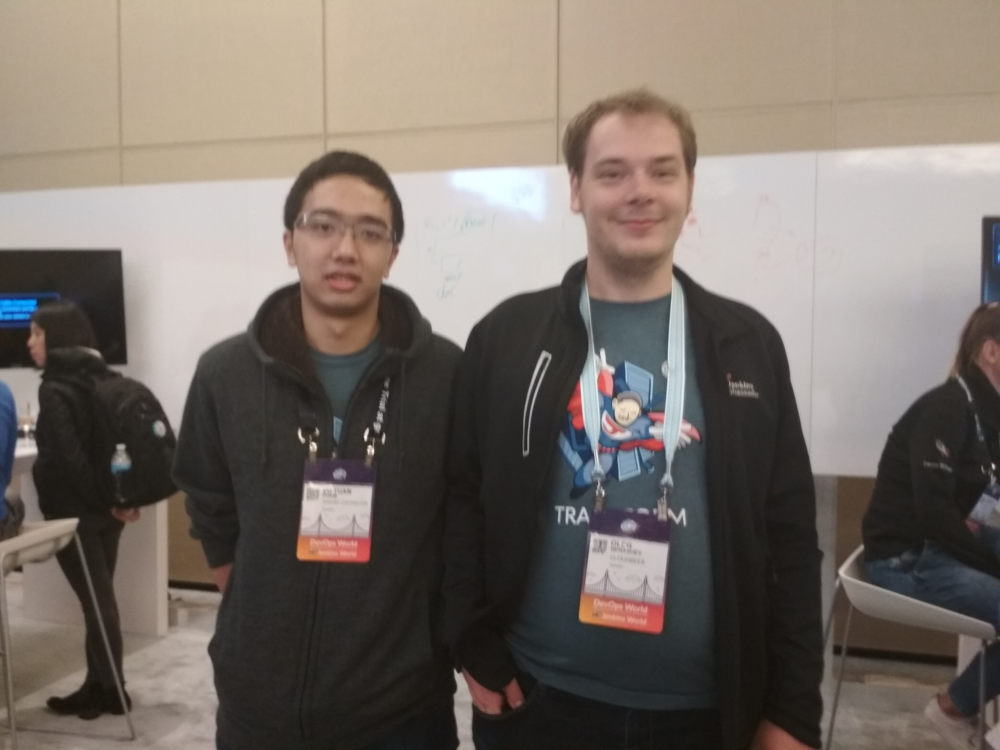

# Day 2: Free day

I got a Sunday free before the conference and I spent most of the time to recover and go shopping to buy some gifts for my family and friends. Because I visited SF last year already, there is no tourist place that interests me this time. I also had a chance to meet [Martin](https://github.com/martinda) in person. He is also another GSoC mentor, but I did not work directly with him. This was a good day to rest before the next 5 days of conference and hackathon.

# Day 3: Jenkins Contributor Summit

Monday is the day of Jenkins Contributor Summit where people from all over the world come to the Summit to summarize about Jenkins community in the previous year. The morning session focused to summarize Jenkins main areas. If you are interested to know more, can find it in the [Google docs](https://docs.google.com/document/d/1by_lYIwPhburTqmtTvEqek6ifc2qnqBJKyDVslGa4Kc/edit?usp=sharing).

<figure>
  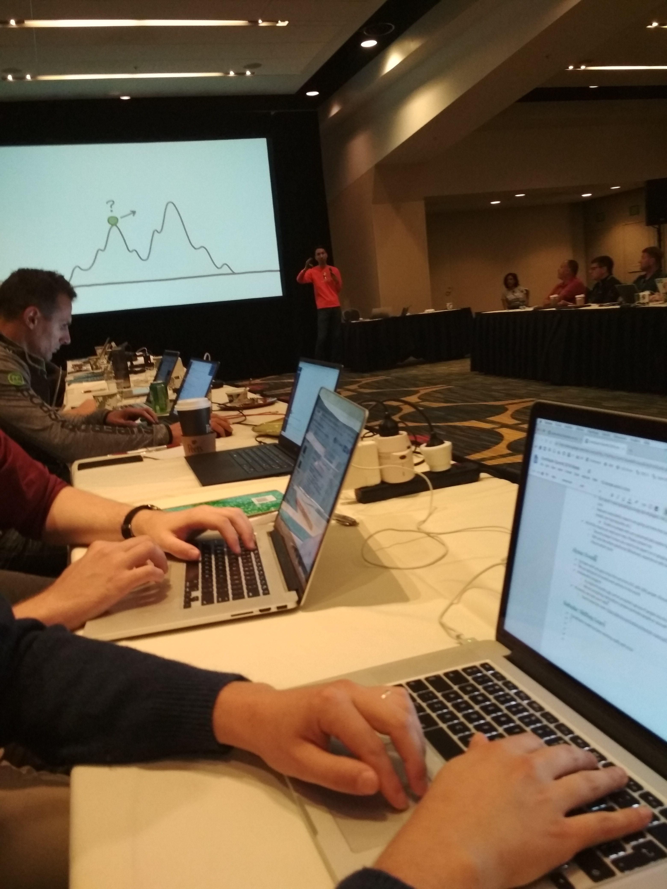
  <figcaption>
<a href="https://en.wikipedia.org/wiki/Kohsuke_Kawaguchi/">Kohsuke</a> speak at the summit about Jenkins <a href="https://jenkins.io/blog/2018/08/31/shifting-gears/">Shifting Gears</a>
</figcaption>
</figure>

In the afternoon, people are separated in to different SIG meeting of Jenkins called BoF table. I decided to join Cloud Native BoF where I had my presentation about [Remoting Kafka Plugin](https://docs.google.com/presentation/d/1drRIDNvDKdBE-VuuLFXlWRB0NhSFr1aWrg2p8qrF3co/edit?usp=sharing) - GSoC project that I did last summer. Summary of SIG meeting available [here](https://docs.google.com/document/d/1Hw1mpXSpH8BAe2YK5SrCfFuHQLRf__KnjDBK_SbhGls/edit?usp=sharing).

In the evening I was invited to attend Jenkins Contributor Appreciation Event where we come to a restaurant nearby to have food, drinks and talk with contributors of Jenkins project. Interestingly, the restaurant is also decorated with ping pong tables.

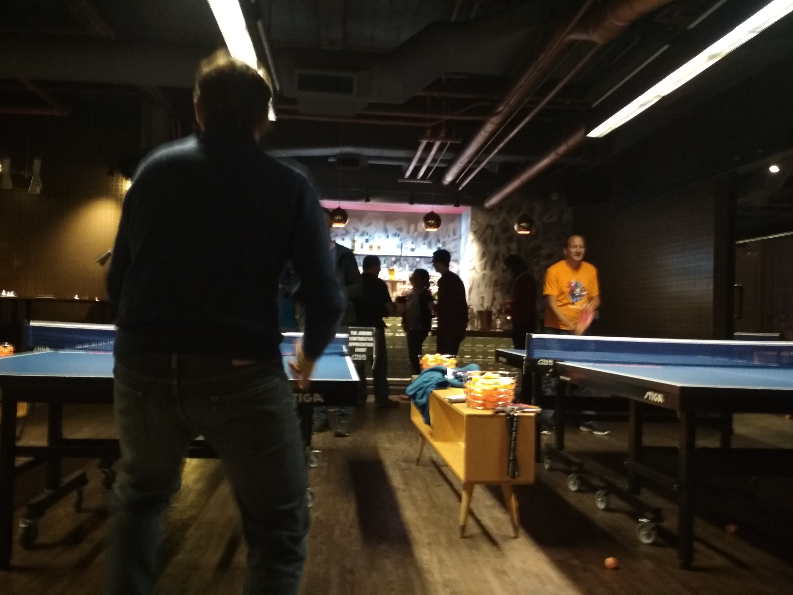

I also had a chance to take picture with [Kohsuke](https://en.wikipedia.org/wiki/Kohsuke_Kawaguchi) - the creator of Jenkins software.

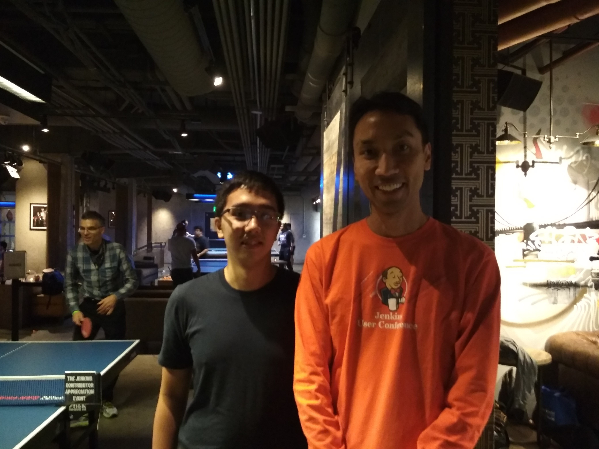

# Day 4: Conference Day 1

Tuesday is the first day of DevOps World - Jenkins World 2018. This is the first time ever in my life that I have a chance to atend a tech conference. This conference is big with around 2000 participants from tech companies all over the world.

<figure>
  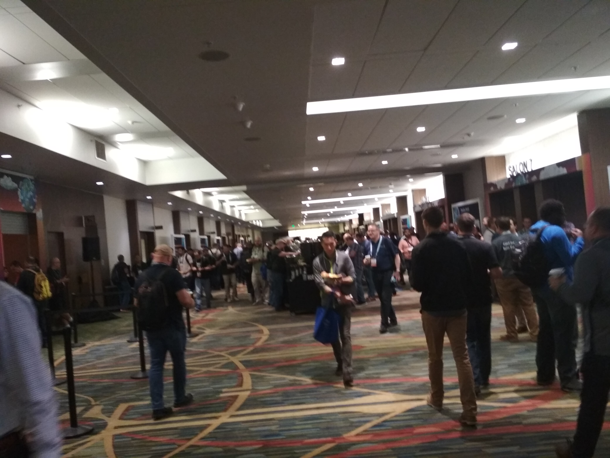
  <figcaption>
Conference Main Lobby
</figcaption>
</figure>

<figure>
  
  <figcaption>
My name tag 😛
</figcaption>
</figure>

Morning session is where the keynotes are delivered by CEO, CTO and CPO of [CloudBees](https://www.cloudbees.com/) about DevOps and Jenkins. In the first keynote by Kohsuke, there are 5 superpowers of Jenkins are introduced, they are:

- Jenkins Pipeline
- Jenkins Evergreen - an automatically updating rolling distribution system for Jenkins
- Jenkins Configuration as Code
- Cloud Native Jenkins
- Jenkins X - automated CI/CD for Kubernetes 

<figure>
  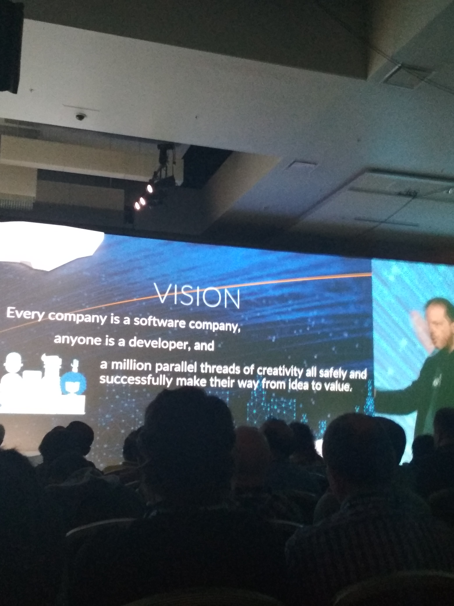
  <figcaption>
Keynotes by CEO of CloudBees <a href="https://www.cloudbees.com/team/sacha-labourey">Sacha Labourey</a>
</figcaption>
</figure>

After keynote session, people went to the rooms to attend talks by speakers until the end of the day. One of the talk I found interesting is [A Cloud native Jenkins](https://devopsworldjenkinsworld2018.sched.com/event/F9NT/a-cloud-native-jenkins) by my mentor Oleg and [Jesse Glick](https://github.com/jglick) - developer from CloudBees. I also got a lot of swags from the conference (stickers, T-shirts, ...) but I forgot to take the photos T_T.

<figure>
  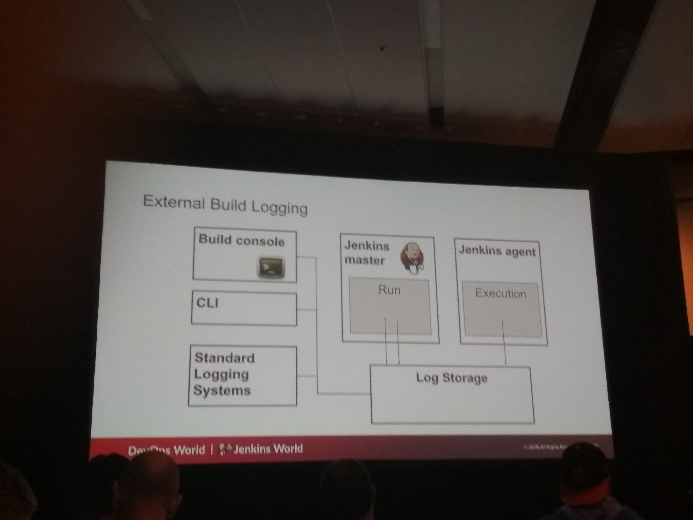
  <figcaption>
A slide from "A Cloud Native Jenkins" talk
</figcaption>
</figure>

# Day 5: Conference Day 2

Second day of the conference is almost the same as the first day with keynote session in the morning and talks followed until late afternoon. If you are interested in the keynotes, can watch it [here](https://www.youtube.com/watch?v=1AVZ9HfXZRE). There is one interesting thing for this second day is our GSoC team with [Oleg](https://github.com/oleg-nenashev), [Martin](https://github.com/martinda), [Jeff](https://github.com/jeffpearce) and me had a small presentation about [Jenkins Google Summer of Code 2018](https://jenkins.io/projects/gsoc/) result. It was a great summer with all of you. Hope we can continue working together for upcoming years.

<figure>
  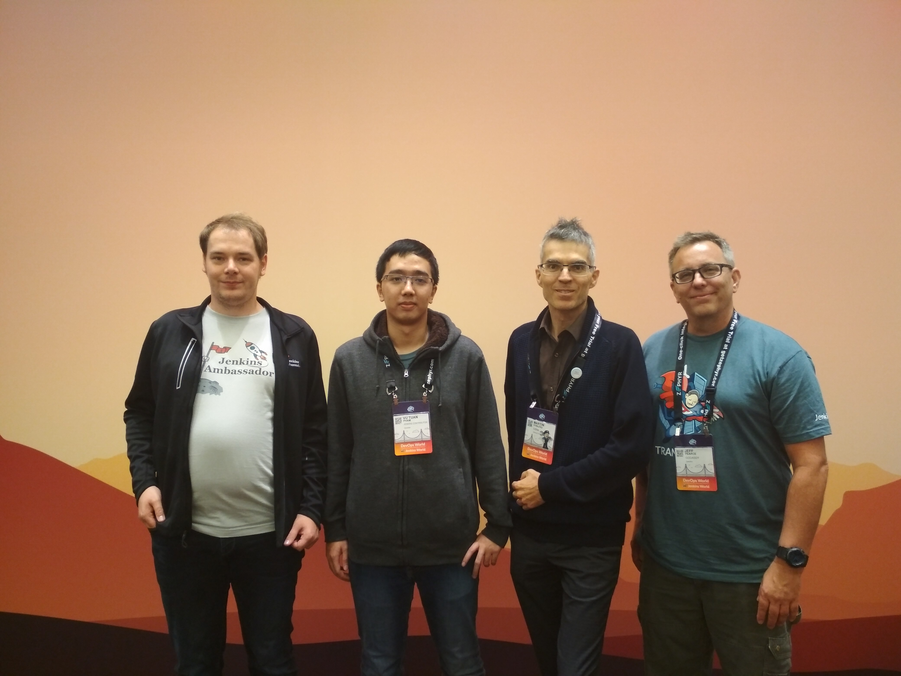
  <figcaption>
Photo of GSoC team
</figcaption>
</figure>

After closing keynote session in the afternoon, a group Jenkins contributors (include me) got in the bus and went to the hackhouse in San Leandro, which is about 1 hour of driving from San Francisco. We were going to have a hackathon there for the next few days in the hackhouse after the conference. The hackhouse was a huge house with enough bedrooms for 20 people to sleep. It was a American house with Chinese architecture, up on a hill with a magnificient view.

<figure>
  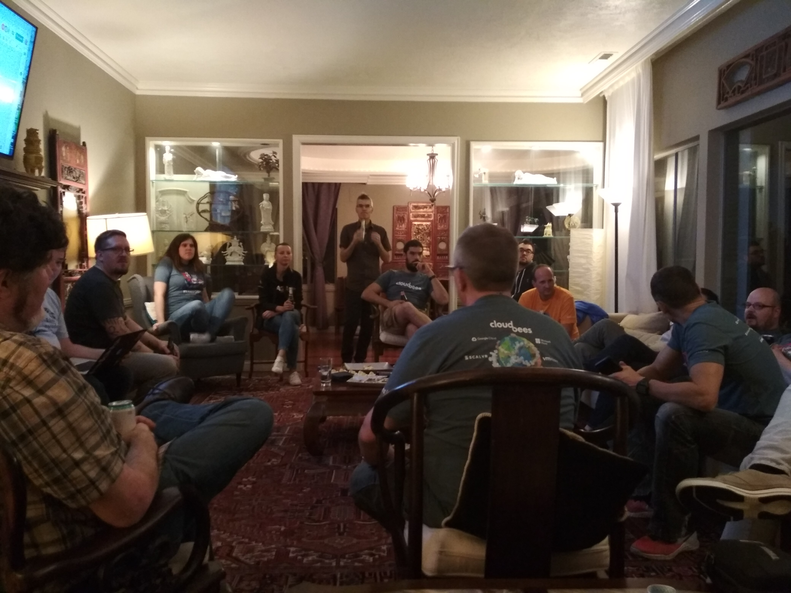
  <figcaption>
People chill in the afternoon
</figcaption>
</figure>

<figure>
  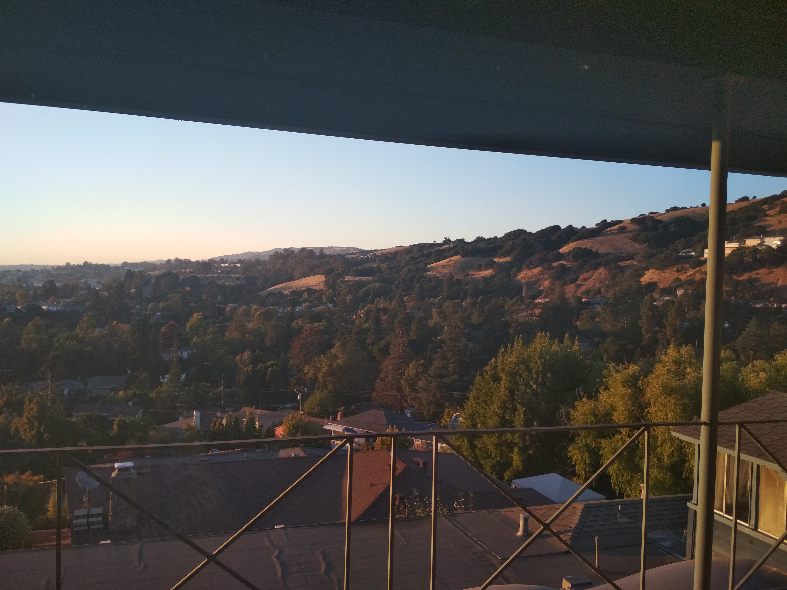
  <figcaption>
View from the hackhouse, I'm not good at taking photo :(
</figcaption>
</figure>

# Day 6: Hackathon Day 1

In the morning, people were expected to separate in groups to work for the hackathon, but an unexpected thing happen: our Wifi spoilt and we took 1-2 hours to get it fixed. The final solution was to buy a new router lol.

<figure>
  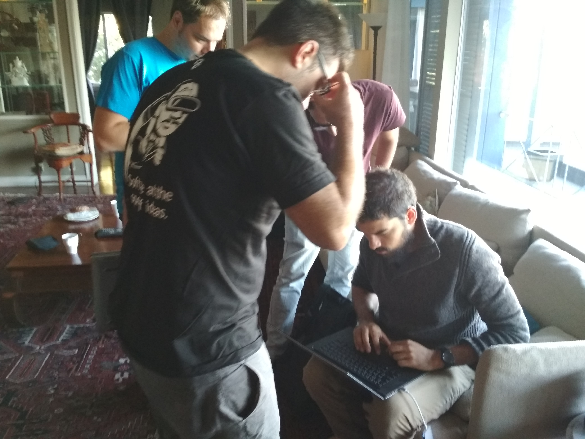
  <figcaption>
People tried to fix the Wifi
</figcaption>
</figure>

After wifi was fixed, people were separated into 3 different groups:

- Java 11 Support for Jenkins
- Configuration as Code Plugin support
- Jenkins Infrastructure Improvement

I decided to try with Jenkins Infra team with [Oblak](https://github.com/olblak) and [Micheal](https://github.com/mpailloncy). At the end of the day, I finished migration of Jenkins DNS (jenkins.io and jenkins-ci) to Microsoft Azure.

<figure>
  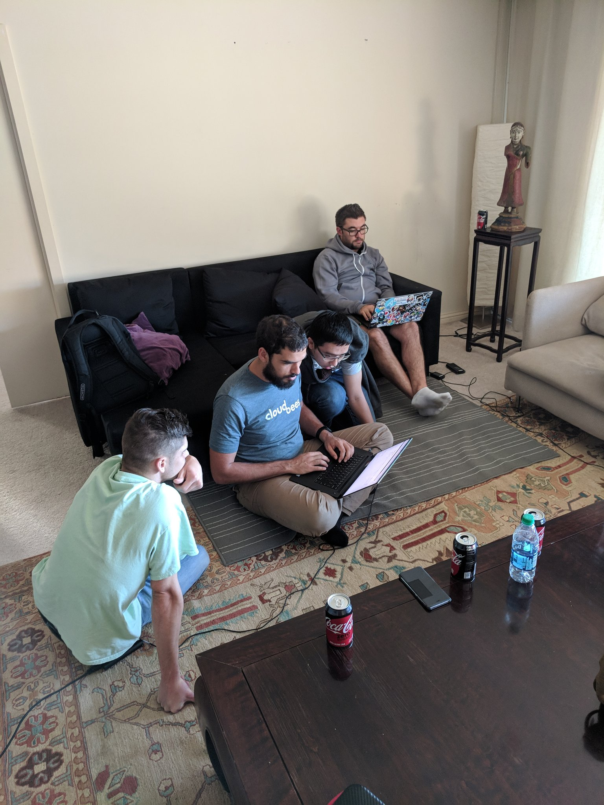
  <figcaption>
Infra team working for the hackathon
</figcaption>
</figure>

Evening was a chill evening where peole had dinner, drinks and played Mario Kart.

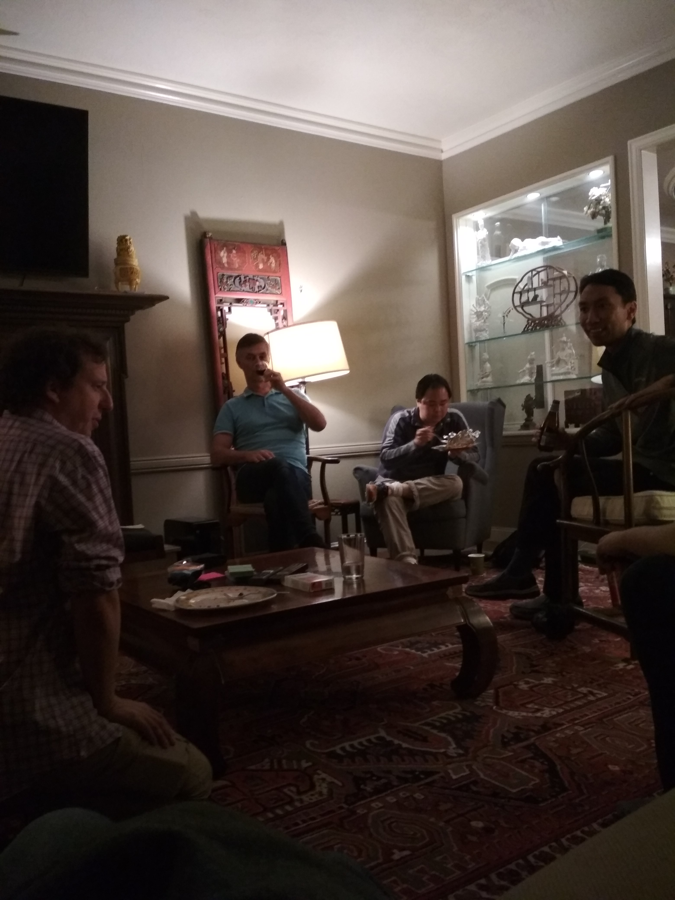

<figure>
  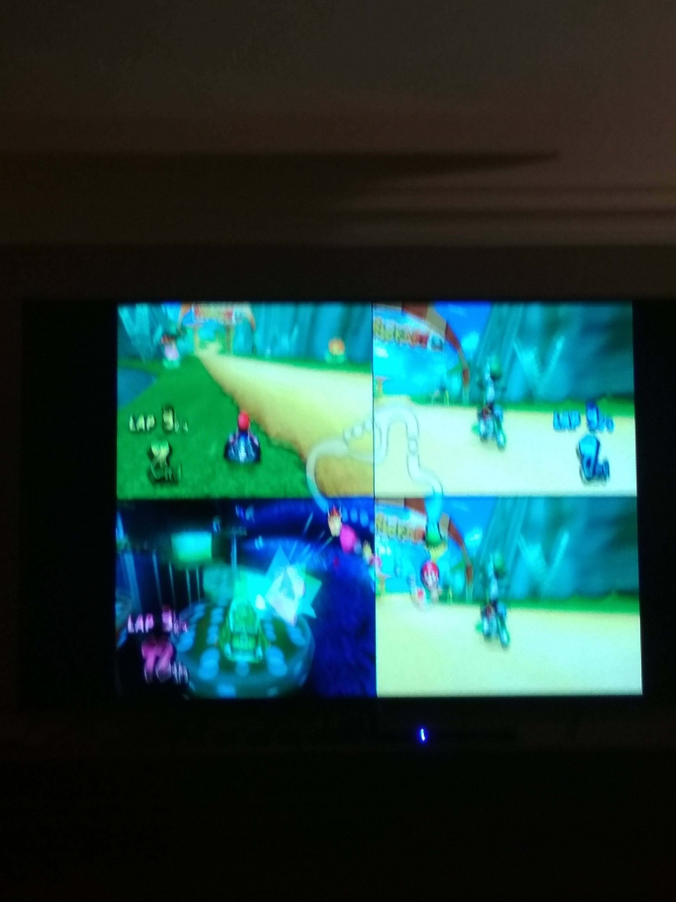
  <figcaption>
Mario Kart
</figcaption>
</figure>

# Day 7: Hackathon Day 2 + Travel Day

For the second day of the hackathon, I decided try to work on another part. I had a discussion in the morning with Oleg, Martin and [Sam](https://github.com/svanoort) about handover of [Simple Pull Request job Plugin](https://github.com/jenkinsci/simple-pull-request-job-plugin), another GSoC project that was partially finished by [Abhishek](https://github.com/gautamabhishek46). From that meeting until now, I was assigned as the maintainer of the project and did some improvements to make the project to be ready for 1.0-rc release. If nothing changes, I will try to release the plugin to the community in the next few weeks.

Last day of the hackathon also people reported about what has been done during 2 days of the hackathon. If you are intersted, can find it [here](https://docs.google.com/document/d/1eI3e5u4XoE1q06wILv9sDRvYh91n1JCqZ4M1njcpp_Q/edit) (Somehow I don't have permission to access this link anymore).

This was also my last day for my second time in US. I feel that I was lucky enough to come to Jenkins World and had a chance to get know to a lot of people here. I was very inspired about how people make software when coming to San Francisco this year. Last but not least, thank you Alyssa (I did not know you are also a Vietnamese until Oleg told me and we talked together) for providing logistics to me to come and for organizing the events. It was very heart-warming when I can speak Vietnamese in US (also realized that we did not take photo together T_T). And thank you Oleg for asking me to go to Jenkins World to present my work. It is very great to be your mentee, you really helped me a lot for the last 6 months. I hope we can have chances to work together more in the future.

<figure>
  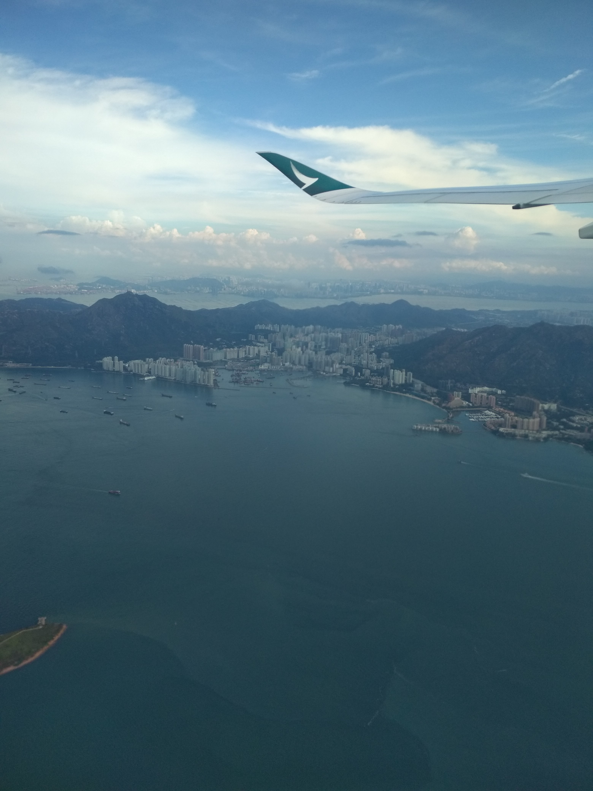
  <figcaption>
From airplane when leaving Hong Kong to Singapore
</figcaption>
</figure>

This is also the end of my blogpost about my trip. This took me about 2 weeks to write this blogpost together with setting up my personal website. If you are still reading until this end, thank you so much! 